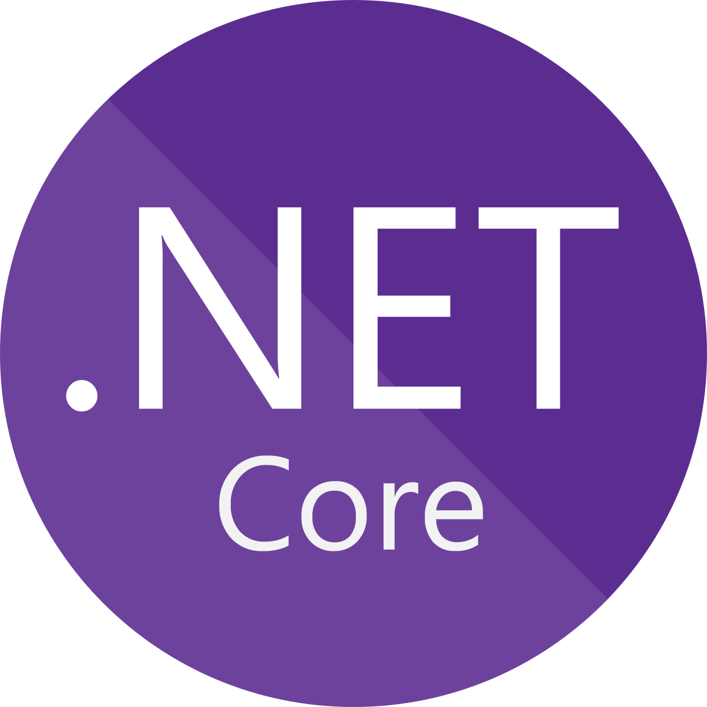
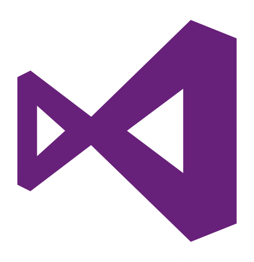
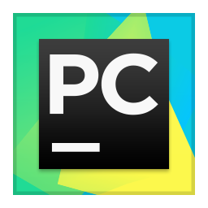

<h1>Hello 👋</h1>

I'm Amed! I'm a developer passionate about learning and developing new technologies. I usually work on Python, C# and SCL.
- 💻 Currently working on React Native

<h2 align="center">Languages & Frameworks & Tools & Abilities</h2>

  <code></code>
  <code></code>
  <code></code>
  <code></code>
  <code></code>
  <code></code>  
  <code></code>
  <code></code>
  <code></code>
  <code></code>
  <code></code>
  <code></code>
  <code></code>
  <code></code>
  <code></code>
  <code></code>
  <code></code>

  

